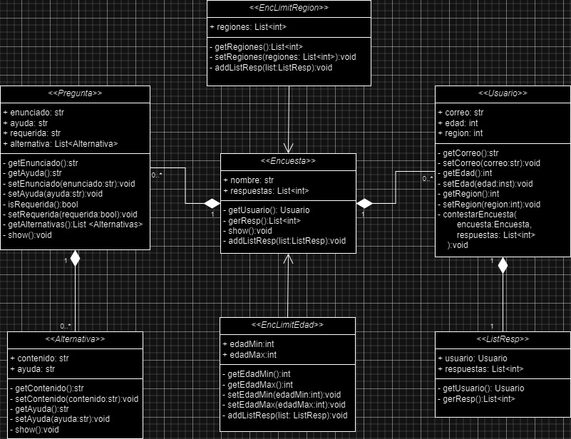

# Evaluación  - Diagrama de Clases

Dentro de este proyecto se solicita crear un diagrama de clases, para ello nos entregaron en resumen un sistema de encuestas y a partir de dicho diagrama crear las clases y de manera opcional implementar la logica de las operaciones. 
A continuación se adjunto el diagrama en formato svg

### Diagrama del codigo implementado

